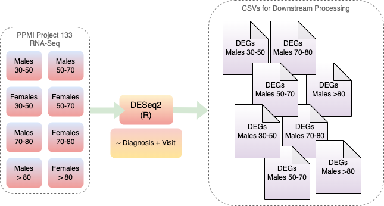

# Computational Analysis of Transcriptome Data and Mapping of Functional Networks in Parkinson’s Disease
___

This work uses datasets from the [Parkinson's Progression Markers Initiative, (PPMI)](https://www.michaeljfox.org/ppmi).

Data used in the preparation of this article was obtained on 2025-03-01 from the Parkinson’s Progression Markers Initiative (PPMI) database (www.ppmi-info.org/access-data-specimens/download-data), RRID:SCR_006431. For up-to-date information on the study, visit www.ppmi-info.org. 
PPMI – a public-private partnership – is funded by the Michael J. Fox Foundation for Parkinson’s Research, and funding partners, including 4D Pharma, Abbvie, AcureX, Allergan, Amathus Therapeutics, Aligning Science Across Parkinson’s, AskBio, Avid Radiopharmaceuticals, BIAL, Biogen, Biohaven, BioLegend, BlueRock Therapeutics, Bristol-Myers Squibb, Calico Labs, Celgene, Cerevel Therapeutics, Coave Therapeutics, DaCapo Brainscience, Denali, Edmond J. Safra Foundation, Eil Lilly, GE HealthCare, Genentech, GSK, Golub Capital, Gain Therapeutics, Handl Therapeutics, Insitro, Janssen Neuroscience, Lundbeck, Merck, Meso Scale Discovery, Mission Therapeutics, Neurocrine Biosciences, Pfizer, Piramal, Prevail Therapeutics, Roche, Sanofi, Servier, Sun Pharma Advanced Research Company, Takeda, Teva, UCB, Vanqua Bio, Verily, Voyager Therapeutics, the Weston Family Foundation and Yumanity Therapeutics.

___

This work leverages information contained in the metadata of the appropriate dataset to stratify samples according to sex and age group.
Differential Gene Expression Analysis is conducted as a means to gain an overview of the expression patterns among the age groups by comparing healthy controls and case samples. Furthermore DGEA is used as a feature selection mechanism for setting up a stratified classification by using several classification models. A subsequent SHAP analysis extracts the importances per feature to present which features (genes) impacted classification decissions the most. Ultimately, the results harvested from the pipeline could serve as potential biomarkers and further assessed by proper wet-lab verification routines

The samples used were derived from whole blood, gathered from patients and healthy controls over the course of several visits.

A schematic overview of the pipeline's parts is included below:

### 1. Differential Gene Expression Analysis step

### 2. Machine Learning classification 

### 3. Geneset Enrinchment Analysis

___

All sources placed within numbered directories with numbered python source files. The numbers denote the order of execution. The data isn't included and must be downloaded from https://ida.loni.usc.edu/. Also, any string literal denoting a directory on the filesystem must be adjusted and created, in case a directory is supposed to store results generated from any of the sourcefiles.

The DGEA part of the study is written in R and included within this repository as well.

In case of questions please do not hesitate to raise them as an issue in the respective section of this repository and I'll do my best to answer as soon as possible.
